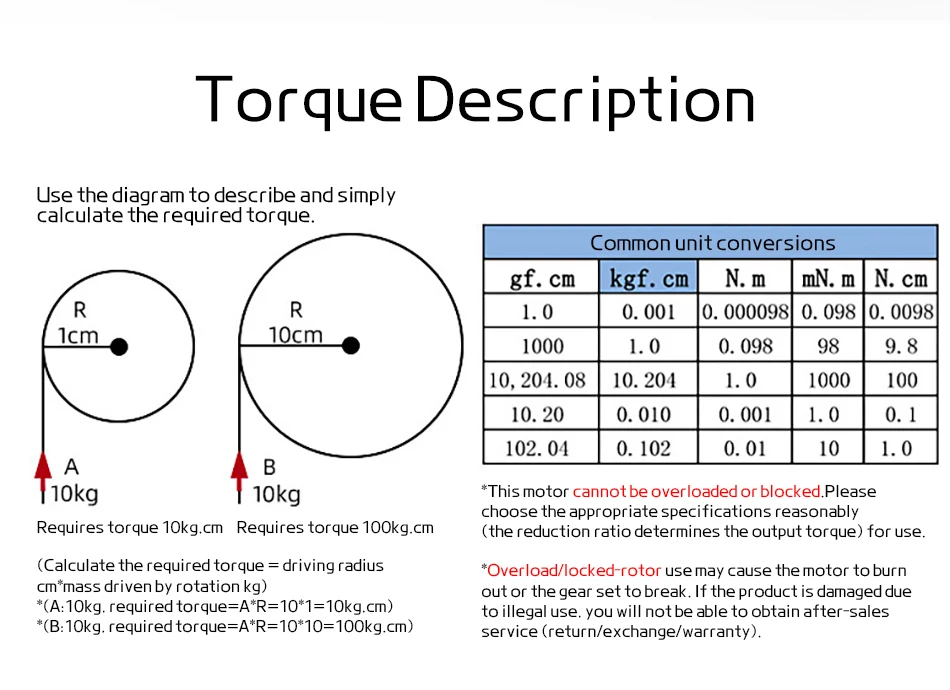
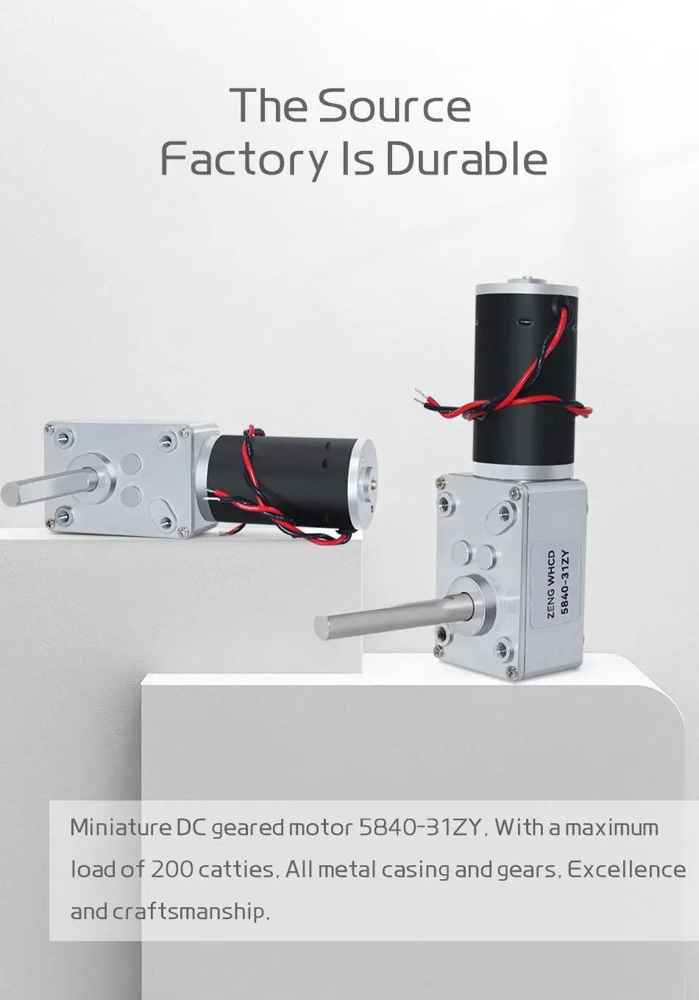
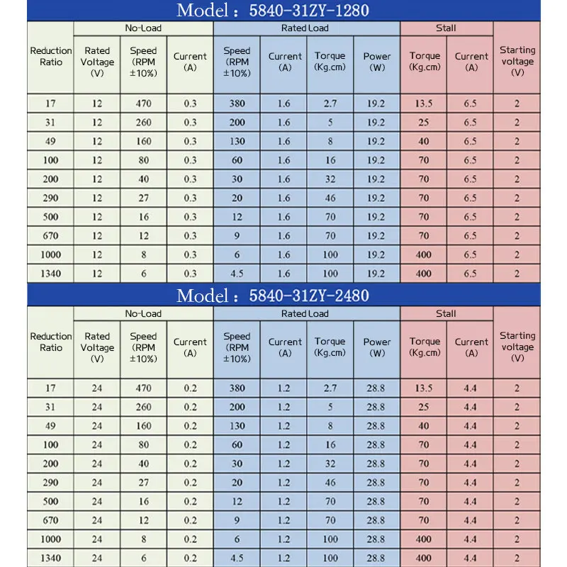
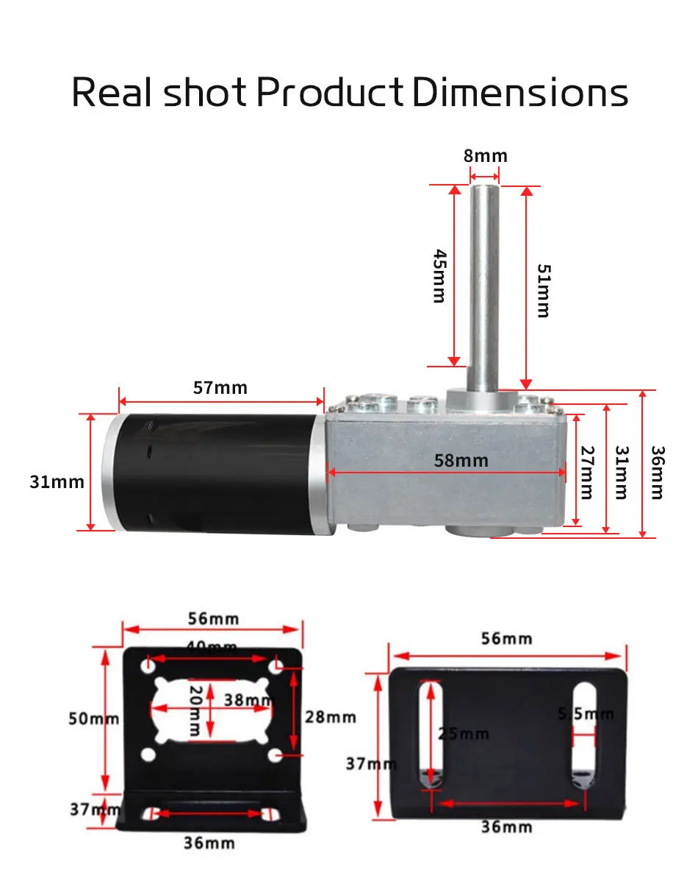
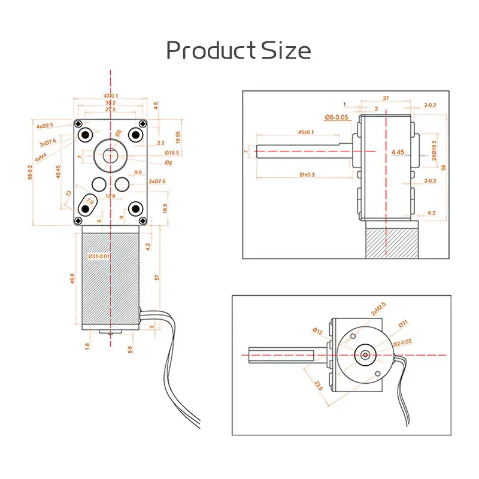
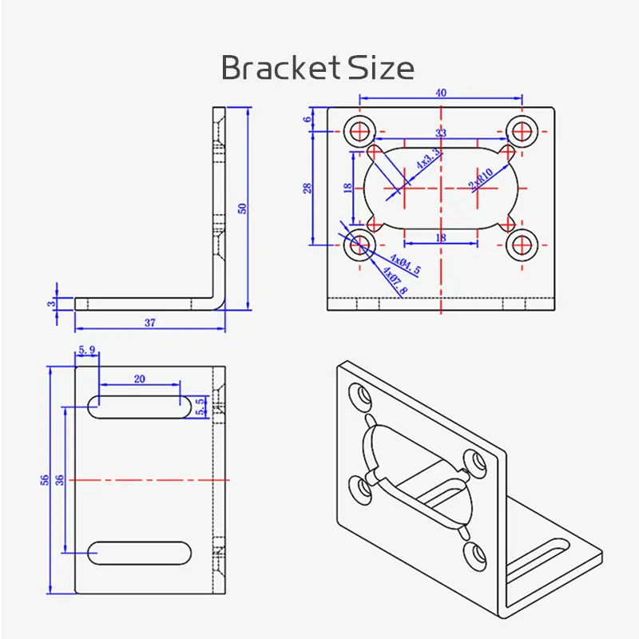
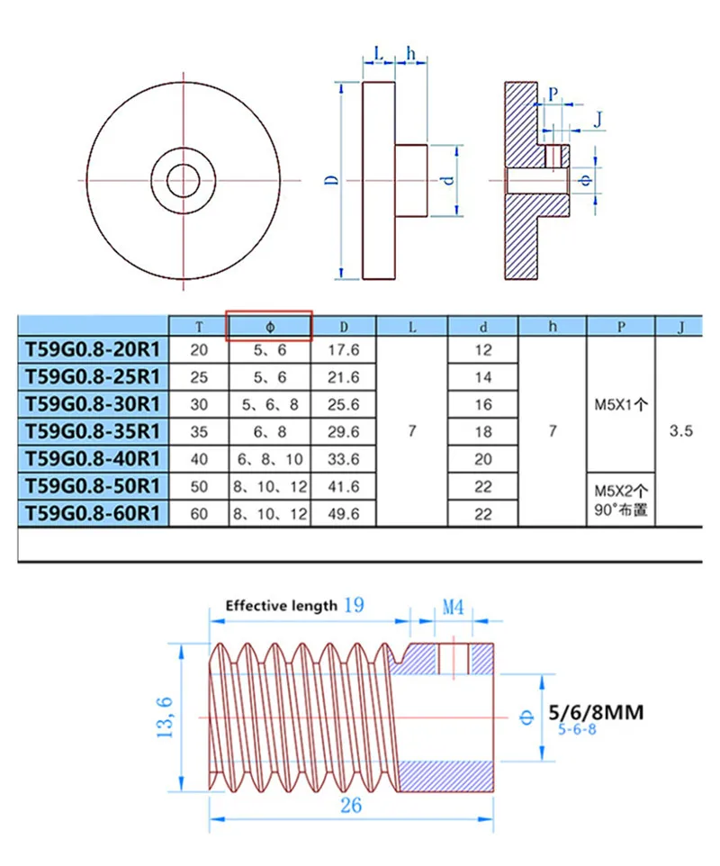

# Horloge

# Paramètres

- Diamètre du disque/support : Ø ~650 mm
- Longueur bras : ~400 mm (centre ? extrémité)
- Masse bras : ˜ 2 kg, centre de gravité à ~200 mm de l’axe
- Vitesse : 1 tr/min (sens horaire)

- Couple statique à l’horizontale ˜ m·g·r = 2×9,81×0,2 ˜ 3,9 N·m.

Avec pertes (vis sans fin, frottements) et marge x2–3 => viser 8–12 N·m au niveau de l’axe.

# Liste de composants 
version robuste et simple à sourcer

## Mécanique

- Axe acier rectifié Ø12 mm (longueur selon épaisseur de panneau + entretoises, prévoir ~160–200 mm).
- 2 roulements à billes type UCFL204 (paliers fonte avec roulement Ø alésage 20) ou version compacte : 2× 6001-2RS (Ø int. 12, Ø ext. 28) + logements.
- Moyeu de bras (aluminium/acier) alésage Ø12 avec vis de pression pour fixer le bras.
- Roue dentée pour vis sans fin (bronze/acier), 60 dents module 1 (exemple Ø ~60–65 mm, alésage adapté à l’axe Ø12).
- Vis sans fin module 1 (1 départ) sur arbre moteur, entraxe correspondant à la roue.
- Châssis / panneau support (contreplaqué 15–18 mm ou tôle) + entretoises et équerres.
- Fixations (visserie M4/M5, rondelles, frein filet), goupille ou vis pointeau pour solidariser roue/axe.
- Butée axiale (bagues + rondelles de calage) pour éliminer jeu axial de l’axe.

## Motorisation & transmission
- Moteur DC 12 V ~50–100 tr/min en charge, couple =0,3 N·m sur l’arbre moteur.

Avec réduction 60:1 par vis sans fin ? sortie axe ˜ 1 tr/min et couple ×60 ? ~18 N·m potentiel (avant pertes), suffisant.

Accouplement moteur -> vis sans fin (rigide ou flexible 6–8/8–10/… mm selon arbres).

Support moteur réglable (pour ajuster l’entraxe et le jeu d’engrènement).

### Caractéristiques

## Élec/Contrôle
- Alimentation 12 V 5 A (marge confortable).
- Contrôleur PWM 12 V (2–10 A) pour régler finement la vitesse à 1 tr/min.
- Interrupteur marche/arrêt + porte-fusible (fusible 3–5 A).
- Câbles 1–1,5 mm², cosses, serre-câbles.

## Sécurité / Divers
- Carters imprimés/pliés pour couvrir roue + vis sans fin.
- Contrepoids discret optionnel (à l’arrière du moyeu) si besoin d’équilibrer le bras.
- Frein anti-retour inutile avec une vis sans fin (auto-bloquante), mais possible via petit ressort/aimant si nécessaire.

# Schéma

## Moteur

## Entrainement

### Paramètres de transmission

## Roulements

# Notes d’assemblage

- Aligner parfaitement roue et vis sans fin (jeu latéral minime, léger jeu fonctionnel au contact).
- Caler l’axe dans les roulements avec des entretoises pour que la roue tombe bien en face de la vis sans fin.
- Fixer solidement le moyeu sur l’axe (pointeau sur méplat) et visser le bras au moyeu.
- Démarrer à vitesse plus élevée avec le PWM puis régler à 1 rpm (une marque sur le bras aide au réglage).
- Vérifier l’échauffement du moteur après 15–30 min : il doit rester tiède.
